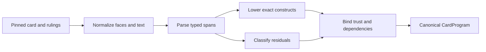

# Oracle compiler architecture

The compiler transforms a pinned local card and rulings snapshot into typed
Oracle IR, recognized semantic nodes, dependency declarations, material
residuals, and a canonical `CardProgram`. For the same inputs and compiler
version, the result must be deterministic.

## Stage ownership

`oracle_ir.py` owns parsing and IR compatibility.
`compiler/program_generation.py` owns lowering exact nodes into registry
programs. `card_programs/adapters.py` combines abilities, face identity,
source hashes, residuals, and capability closure into the canonical artifact.
The local card database is a compiler input; the engine does not query it while
performing a transition.

`compiler/fixed_target_effect_sequences.py` owns the closed cross-sentence
target-threading grammar. It is the only compiler authority for represented
fixed counter plus until-end-of-turn characteristic sequences: one clause
establishes direct creature target zero, later clauses use the exact pronoun
“it,” and printed operation order is retained. The runtime consumes only the
resulting typed node and never reparses those Oracle sentences.

## Invariants

- Every lowered node retains its exact source provenance.
- Unknown or ambiguous grammar becomes a source-spanned residual, never
  guessed behavior.
- Instruction order, targets, modes, choices, and continuations remain
  explicit in the typed result.
- Parsing success is separate from runtime and rules closure.
- A reviewed ability can supersede generated output only at the same stable
  semantic key; conflicts fail closed.
- Compiler output cannot claim trust beyond all declared capabilities and
  runtime dependencies.
- Card names and Oracle IDs are evidence and lookup keys, not generic runtime
  behavior switches.

Activated-mana lowering has separate closed owners for fixed output and
current color-set output. The color-set grammar represents choosing one color
among qualifying legendary permanents or legendary creatures and
planeswalkers, choosing among owned legendary creature cards in a graveyard,
and adding one mana of each color among controlled permanents. Each form
lowers an immutable relative `ObjectQuerySpec`. Monocolored-only, linked-exile,
opponent-relative, additional-condition, restricted, and side-effecting
variants remain source-spanned residuals.

Fixed mass-damage lowering uses the same complete `ObjectQuerySpec` descriptor
consumed by the runtime affected-set snapshot. The compiler emits ordered
player/permanent groups and an optional exact target-opponent controller; it
does not encode card names or reparse Oracle text during resolution. Only the
closed positive predicates represented by the object-query vocabulary are
accepted. Negative keyword or subtype predicates, divided or variable damage,
multiple damage clauses, and linked result riders remain source-spanned
residuals until their own typed families exist.

Source-self wording uses one immutable `SourceReferenceSpec` across represented
counter, damage, prevention, trigger, entry, activation-cost, and declaration
grammar. It accepts the full Oracle name and bounded complete leading forms
before a comma, the title delimiters “the” or “of,” or a bounded ordinary
two-word name. It never guesses an arbitrary prefix, suffix, or nickname.
Lowered instructions use `$source`; runtime handlers do not receive names or
reinterpret Oracle text. See
[ADR 0040](../adr/0040-closed-source-self-references.md).

## Extending the compiler

Add the smallest reusable grammar production and typed construct. Include
source-pinned positive, negative, ambiguity, residual, canonical-JSON, and
runtime-lowering tests. Reuse an existing runtime primitive when its contract
matches exactly; otherwise leave the construct residual until the primitive
has its own owner and assurance. Regenerate the compiler and rules reports
through their owning commands rather than editing them by hand.

Schema changes and new stage ownership require an ADR. Current coverage and
blockers live in the generated
[compiler status](../COMPILER_COVERAGE_STATUS.md); stable IR fields and
provenance live in the [Oracle IR reference](../reference/oracle-ir.md).
See [ADR 0005](../adr/0005-card-program-v2.md),
[ADR 0006](../adr/0006-typed-semantic-handler-boundary.md), and
[ADR 0022](../adr/0022-reusable-rules-piece-inventory.md).
