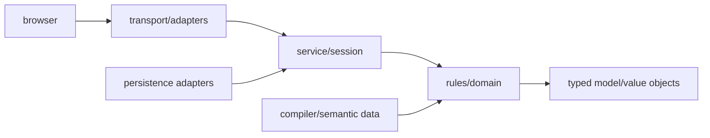

# Dependency and mutation rules

The executable policy in `platform/architecture-policy.json` is authoritative.
This document explains its intent.

Dependencies point toward the domain. Protected rules/domain modules may not
import server frameworks, WebSockets, persistence adapters, AI providers, or
application/session orchestration. Compiler and metadata code may describe
rules programs but may not acquire runtime mutation authority.

`quorune/card_programs/` owns the deterministic CardProgram V2 model,
generated/reviewed adapters, source/trust validation, and inspection commands.
It may depend on compiler output, semantic value objects, the card database,
and capability metadata. It must not depend on transport, server, pilot,
session, or persistence orchestration, and it never mutates `GameState`.

`quorune/semantic_runtime/` owns typed node handlers, their immutable
query context, typed intents, deterministic registry, and canonical intent
executor. Its scoped architecture policy additionally forbids imports of the
engine, state model, record, or projection modules. The engine may call inward
to this pure boundary; handlers cannot call outward to authoritative state.
The executor may route a typed intent to a classified rules-layer mutation
port. `quorune/tap_state.py` is such a port. The replacement event
boundary also routes represented counter events to
`quorune/counter_placement.py`. Represented damage events route to
`quorune/damage.py` for proposal preparation, replacement/prevention,
atomic result commit, and final-event dispatch. Direct destruction,
permanent-exile, battlefield return-to-owner-hand, and own-graveyard card
return intents route to
`quorune/destruction.py`, `quorune/permanent_exile.py`, and
`quorune/return_to_hand.py`. Exile and return share the closed
`rules/single_object_zone_transition.py` typed-origin preparation, stale-plan
validation, and commit substrate while retaining distinct results and journals. Destruction
remains a separate disposition family. These transaction owners delegate
authoritative counter or zone writes to existing canonical owners. Direct stack-counter intents route to
`quorune/stack_counter.py`, which owns counterability, stack removal,
replacement-aware physical spell movement, normalized counter-event dispatch,
telemetry, and public journaling behind a narrow host protocol. These ports depend on narrow
structural host protocols rather than the engine class and are authorized by
[ADR 0009](../adr/0009-typed-tap-state-mutation-owner.md) and
[ADR 0011](../adr/0011-counter-placement-event-and-mutation-owner.md), plus
[ADR 0012](../adr/0012-damage-transaction-and-static-prevention.md),
[ADR 0027](../adr/0027-typed-permanent-destruction.md),
[ADR 0028](../adr/0028-typed-return-to-owner-hand.md),
[ADR 0029](../adr/0029-typed-permanent-exile.md),
[ADR 0030](../adr/0030-typed-stack-counter.md), and
[ADR 0053](../adr/0053-typed-own-graveyard-return-to-hand.md).

Represented zone-destination replacements use an additional narrow split.
`semantic_runtime/zone_replacement_model.py` owns immutable affected-object,
source-effect, and prepared-move values. `zone_replacements.py` owns read-only
descriptor discovery and APNAP preparation. Single and simultaneous moves
capture that model once before mutation. Only `CommanderEngine.move_card`
commits zone membership, so replacement discovery cannot become a competing
state owner.

Every production Python module has one generated exact classification covering
layer, owner, allowed dependency layers, GameState access, specificity,
visibility, and replay participation. A new unclassified module fails CI.
Direct writes are ratcheted by stable file/symbol/mutation/state-path identity,
not line number or aggregate count. Architecture exceptions bind to one exact
ADR and allowance fingerprint.

`CommanderEngine` remains a measured legacy mutation boundary while it is
decomposed. New engine methods, direct `GameState` write sites, card-name/Oracle
ID branches, card-specific operations/helpers, oversized modules/functions, or
unreviewed dependency exceptions fail the architecture gate. Existing debt is
ratcheted rather than endorsed. Engine net logical growth defaults to zero, and
existing oversized modules/functions may not grow.

Any new subsystem documents ownership and dependencies. Changing mutation
ownership or adding a cross-layer dependency requires an ADR. Reviewed legacy
exceptions require an ADR and removal plan; routine Scryfall digest refreshes
cannot alter the reviewed specificity allowance.
